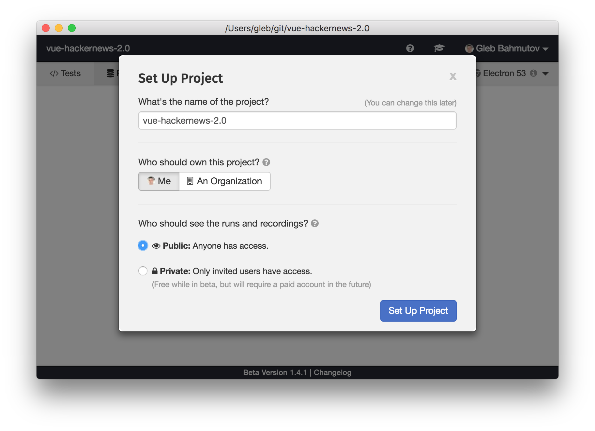

## End to end testing is fun

In this blog post I will show how to test a HackerNews clone without pulling out hair.

There is an elegant and fast Vue.js 2 HackerNews clone made by the framework's author himself: [vuejs/vue-hackernews-2.0](https://github.com/vuejs/vue-hackernews-2.0) with live demo hosted at [https://vue-hn.now.sh/](https://vue-hn.now.sh/). The clone has all the bells and whistles one can expect from a modern progressive application: includes server-side rendering, inlined CSS, routing, single file components, etc. There is only one thing the code is missing - tests! Hmm.


What would it take to quickly confirm that this project is working? Would you need to jump through hoops if you wanted to add tests? Would you write unit tests or would end-to-end tests be better? Would the tests work in a modern browser or using JavaScript DOM emulation? Would the entire experience be full of pain and misery?

I will show you can _quickly_ write lots of end-to-end tests without any pain. These tests are most important ones - because they ensure that the deployed application is actually usable by the end user. My tool of choice is [Cypress](https://www.cypress.io) - our open source free test runner.

### Setup

I start testing by forking the repository and getting a local copy.

```shell
git clone git@github.com:bahmutov/vue-hackernews-2.0.git
cd vue-hackernews-2.0
npm install
```

I add `cypress` NPM dependency. It is a self-contained Electron-based cross-platform module that can be installed on any system that has at least Node v4+.

```shell
$ npm i -D cypress
> cypress@1.4.1 postinstall /git/vue-hackernews-2.0/node_modules/cypress
> node index.js --exec install

Installing Cypress (version: 1.4.1)

 ✔  Downloaded Cypress
 ✔  Unzipped Cypress
 ✔  Finished Installation /git/vue-hackernews-2.0/node_modules/cypress/dist/Cypress.app

You can now open Cypress by running: node_modules/.bin/cypress open

https://on.cypress.io/installing-cypress
+ cypress@1.4.1
added 120 packages in 24.149s
```

I open Cypress once and it scaffolds its settings file `cypress.json` and a folder with spec files.

```shell
$ $(npm bin)/cypress open
It looks like this is your first time using Cypress: 1.4.1

 ✔  Verified Cypress!

Opening Cypress...
```


### First test

The generated `cypress/integration/example_spec.js` file is useful to anyone starting with Cypress - it contains lots of example tests you can execute right away. Because I know the tests I want to show, I will clear the entire file and rename it to just `cypress/integration/spec.js`. Here is my first test.

```js
// cypress/integration/spec.js
describe('HackerNews', () => {
  it('loads', () => {
    cy.visit('https://vue-hn.now.sh/')
    cy.contains('Built with Vue.js')
  })
})
```

I can keep Cypress open while renaming spec files or writing tests - the test runner is watching files and reruns the tests automatically. The first test passes.


Despite the test's simplicity, there is a LOT going under the hood though. The test runner proxies all requests thus [`cy.visit`](https://on.cypress.io/visit) _knows_ that the server successfully responded with an HTML page. Only after the page has loaded the test runner checks if it contains text "Build with Vue.js". Because the world is asynchronous, and any content on the page might be dynamic, Cypress will intelligently wait several seconds for it. If the app is fast, and the text appear quickly - that's great, the test moves on to the next assertion immediately. But if the server takes a few seconds to cold-start - no big deal, the test runner will not fail. This makes Cypress _fast and flake-free_.

Checking for static text is not much fun. Let's make sure we are getting actual news items. I open DevTools (Cypress is running tests in either built-in Electron browser, or any installed Chrome-like browser, Firefox [support is coming](https://github.com/cypress-io/cypress/issues/1096)). Luckily, the application has nice class names we can use to select list elements.


### Items test

The second test will make sure the application displays 30 news items.

```js
it('loads news items', () => {
  cy.visit('https://vue-hn.now.sh/')
  cy.get('.news-item').should('have.length', 30)
})
```

The test runner reruns our tests, and ... hmm ... it fails.


Luckily, a single look at the error message is enough to diagnose the problem. Hovering over the error message or clicking on it even shows the DOM snapshot and all the elements selected during the command. I assumed that the application would show 30 news items, just like the original [https://news.ycombinator.com/](https://news.ycombinator.com/), but this app only shows 20. I will change the assertion to make sure there are more than 10 items. Cypress comes with all [Chai, jQuery-Chai and Sinon-Chai](on.cypress.io/assertions) assertions, and you can add your own libraries.

```js
// need at least 10 items
cy.get('.news-item').should('have.length.gt', 10)
```

Everything is green again.


### Configuration

Before I wrote any more tests, let's avoid duplicate `cy.visit` code. We can move the URL to `cypress.json` file for example.

```json
{
  "baseUrl": "https://vue-hn.now.sh"
}
```

Besids `baseUrl` there a lot of [configuration options](https://on.cypress.io/configuration) you can pass via `cypress.json` file, CLI options or environment variables. I suggest installing [cypress.json schema file](https://on.cypress.io/configuration#IntelliSense) to get IntelliSense support. It suggest options as you start typing new property name or hover over existing settings. For example, this tooltip explains the `baseUrl` configuration variable.


Next I update my spec file and move opening the page to `beforeEach` callback.

```js
/* eslint-env mocha */
/* global cy */
describe('HackerNews', () => {
  beforeEach(() => {
    cy.visit('/')
  })
  it('loads', () => {
    cy.contains('Built with Vue.js')
  })
  it('loads news items', () => {
    cy.get('.news-item').should('have.length.gt', 10)
  })
})
```

I am also showing two comments to make my linter happy - Cypress uses BDD convention, thus `eslint-env mocha` tell linter to accept global `describe, beforeEach, it` functions. Variable global `cy` is injected automatically and has an [extensive API of commands](https://www.cypress.io/api) for the tests to use.

### Routing test

Let us make sure the routing works. The application should display more news when clicking on the "more >" anchor. It should also go back to the first page using browser's "back" button. When we are at the first page, we should not be able to go to the previous page. Let's test this.

```js
it('goes to the second page and back', () => {
  cy.contains('.news-list-nav a', 'more >').click()
  cy.url().should('contain', '/top/2')
  cy.go('back')
  cy.url().should('contain', '/top')
})
it('cannot go to the previous page', () => {
  cy.contains('.news-list-nav a', '< prev')
    .should('have.class', 'disabled')
})
```

The traditional rule of thumb tells developers to write small tests with a single assertion per test. But at Cypress we have invested a lot of time into [helpful error messages](https://www.cypress.io/blog/2017/07/26/good-error-messages/). Not only the test runner is going to tell exactly the reason why a test fails, on CI it will take a screenshot automatically! Plus video recording is turned on by default - thus you will _see_ the steps leading to the failure. So I feel comfortable testing entire scenarios rather than individual actions.

Here is another such scenario. There are comments for each news item. I should be able to click on the comments link, read the comments, then go back to the main list. First, I need to know the selector of the comments link. Rather than "hunting" in the DevTools, I can click on "CSS Selector Playground" target icon and then on the desired item.


The playground tool suggests selector string `cy.get(':nth-child(1) > .meta > .comments-link > a')`, but we can split it up into `cy.get('.news-item').first().find('.meta .comments-link')`. When we click on the link, we are going to the comments page. There is a (brief) loading spinner and then the comments appear. Finally, we can go back to the "Top" news page by using a navigation link.

```js
it('goes to comments and back', () => {
  // see comments for the first story
  cy.get('.news-item')
    .first().find('.meta .comments-link')
    .click()
  // loader disappears, and comments are there
  cy.get('.item-view-comments-header .spinner').should('not.be.visible')
  // note: there might be zero comments
  cy.get('.comment')
    .should('have.length.gte', 0)
    .and('be.visible')
  // go to the top news
  cy.get('nav').contains('Top').click()
  cy.url().should('contain', '/top')
})
```

The result shows the test going through the entire scenario, ensuring that many components of the app are working as expected.


### Continuous Integration

Running Cypress locally is great, but what about our continuous integration server? We want to execute the tests and see every failure somehow. Every CI provider is supported by Cypress - either right out of the box or through the provided [Docker images](https://github.com/cypress-io/cypress-docker-images), but we recommend using our [dashboard service](https://www.cypress.io/dashboard/) to store test results, screenshots and videos. It is a quick setup. From the desktop click "Runs" button.


Each user by default gets a personal organization - or you can create new organization for your team. I will add a new project under my own account, and its results will be publicly visible.



The modal gives me the command to use on my CI server to execute the tests while recording the results on the dashboard. Copy the record key - we will keep it private. The simplest CI to setup for a public GitHub project is Travis. I added the record key I just copied as an environment variable.


The `.travis.yml` file executes `cypress run --record` command.

```yml
language: node_js
node_js:
  - '8'
cache:
  directories:
    - ~/.npm
    - node_modules
script:
  - $(npm bin)/cypress run --record
```

Push the code to GitHub and watch the tests [run on CI](https://travis-ci.org/bahmutov/vue-hackernews-2.0/builds/332310458). Now head over to the [Cypress Dashboard](https://dashboard.cypress.io/#/projects/b1sfu5/runs) and see test results nicely organized, including video of the entire run!


The entire setup took less than a minute.

### Final thoughts

Our Cypress team has put a lot of thought into designing the most developer-friendly end-to-end test runner. It includes [powerful API](https://on.cypress.io/api), [built-in recording](https://on.cypress.io/screenshots-and-videos), [simple CI setup](https://on.cypress.io/continuous-integration) and many [other features](https://www.cypress.io/features) that make the testing experience truly painless. We appreciate any feedback (positive and negative) through the usual channels: GitHub issues, Gitter chat and even Tweets.

If you would like to try Cypress (and why not, it is free and open source!) follow these links

- [github.com/cypress-io/cypress](https://github.com/cypress-io/cypress)
- [Writing your first test](https://on.cypress.io/intro)
- [Examples, tutorials, recipes](https://on.cypress.io/examples)
- [Cypress channel on Gitter](https://gitter.im/cypress-io/cypress)

If you want to try experimental code, we have built a Cypress plugin for unit testing Vue code. It is like a cross between end-to-end tests and [Storybook.js](https://storybook.js.org/). You can find it at [bahmutov/cypress-vue-unit-test](https://github.com/bahmutov/cypress-vue-unit-test).

For Cypress updates, follow [@cypress_io](https://twitter.com/Cypress_io) on Twitter.
